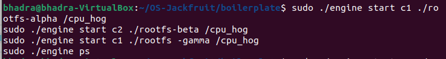
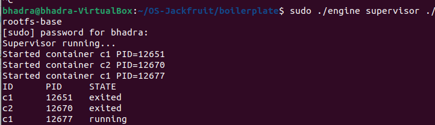
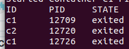
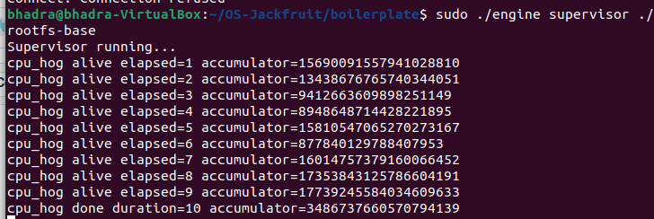
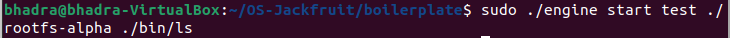
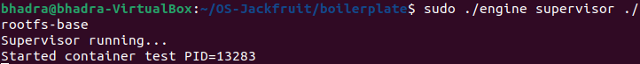
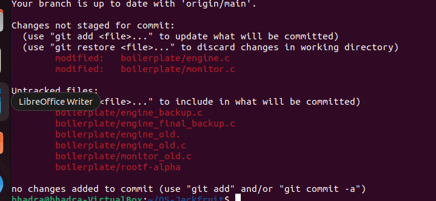
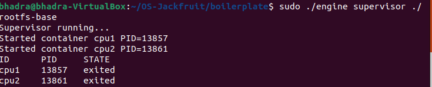
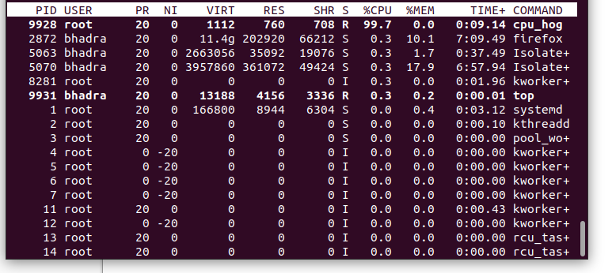
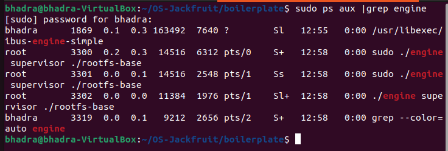

# OS-Jackfruit: Multi-Container Runtime with Kernel Monitoring

# 1. Team Information

## Team Members

* Bhadra RS - SRN:PES1UG24CS111
* Arundhathi K -SRN:PES1UG24CS082

---

# 2. Project Overview

This project implements a lightweight Linux container runtime with:

* Multi-container supervision using a long-running parent supervisor
* Namespace-based isolation (PID, UTS, mount)
* Separate writable root filesystems per container
* CLI commands (`start`, `run`, `ps`, `logs`, `stop`)
* IPC between CLI and supervisor
* Bounded-buffer concurrent logging pipeline
* Linux kernel memory monitor module using `ioctl`
* Soft-limit warning and hard-limit enforcement
* Scheduling experiments using CPU-bound and I/O-bound workloads

---

# 3. Build, Load, and Run Instructions

## Environment

* Ubuntu 22.04 / 24.04 VM
* GCC
* make
* Linux kernel headers

---

## Step 1 — Build Project

```bash id="b1"
cd ~/OS-Jackfruit/boilerplate
make
```

Builds:

* `engine`
* `monitor.ko`
* `cpu_hog`
* `io_pulse`
* `memory_hog`

---

## Step 2 — Load Kernel Module

```bash id="b2"
sudo insmod monitor.ko
```

Verify:

```bash id="b3"
lsmod | grep monitor
ls -l /dev/container_monitor
```

---

## Step 3 — Start Supervisor

```bash id="b4"
sudo ./engine supervisor ./rootfs-base
```

Expected:

```text id="b5"
Supervisor running...
```

Leave this terminal open.

---

## Step 4 — Create Writable Rootfs Copies

```bash id="b6"
cp -a rootfs-base rootfs-alpha
cp -a rootfs-base rootfs-beta
```

---

## Step 5 — Copy Workloads

```bash id="b7"
cp cpu_hog rootfs-alpha/
cp cpu_hog rootfs-beta/
cp io_pulse rootfs-beta/
cp memory_hog rootfs-alpha/
```

---

## Step 6 — Launch Containers

Open second terminal:

```bash id="b8"
sudo ./engine start alpha ./rootfs-alpha /cpu_hog --soft-mib 48 --hard-mib 80
sudo ./engine start beta ./rootfs-beta /cpu_hog --soft-mib 64 --hard-mib 96
```

---

## Step 7 — List Metadata

```bash id="b9"
sudo ./engine ps
```

---

## Step 8 — View Logs

```bash id="b10"
sudo ./engine logs alpha
```

---

## Step 9 — Memory Test

```bash id="b11"
sudo ./engine start mem1 ./rootfs-alpha /memory_hog
sudo dmesg | grep container_monitor
```

---

## Step 10 — Scheduling Test

```bash id="b12"
sudo ./engine start cpu1 ./rootfs-alpha /cpu_hog --nice 0
sudo ./engine start cpu2 ./rootfs-beta /cpu_hog --nice 10
top
```

---

## Step 11 — Stop Containers

```bash id="b13"
sudo ./engine stop alpha
sudo ./engine stop beta
```

---

## Step 12 — Unload Module

```bash id="b14"
sudo rmmod monitor
```

---

# 4. Demo with Screenshots

All screenshots are stored inside:

```text id="img0"
screenshots/
```

---

## 1. Multi-container Supervision

### Screenshot A

```markdown id="img1"

```

### Screenshot B

```markdown id="img2"

```

Caption: Two or more containers tracked under one supervisor.

---

## 2. Metadata Tracking

```markdown id="img3"

```

Caption: `engine ps` displaying container IDs, PIDs, and lifecycle states.

---

## 3. Bounded-buffer Logging

```markdown id="img4"

```

Caption: Container stdout/stderr captured through producer-consumer logging pipeline.

---

## 4. CLI and IPC

### Screenshot A

```markdown id="img5"

```

### Screenshot B

```markdown id="img6"

```

Caption: CLI command issued by client and handled by supervisor over IPC channel.

---

## 5 & 6. Soft-limit Warning + Hard-limit Enforcement

```markdown id="img7"

```

Caption: Kernel module warning at soft limit, then hard-limit kill and unregister cleanup.

---

## 7. Scheduling Experiment

### Screenshot A

```markdown id="img8"

```

### Screenshot B

```markdown id="img9"

```

Caption: CPU-bound workload consuming high CPU share under scheduler.

---

## 8. Clean Teardown

```markdown id="img10"

```

Caption: Containers terminated, reaped correctly, and runtime cleaned up.

---

# 5. Engineering Analysis

## A. Why Namespace Isolation Is Used

Linux namespaces provide separate views of process IDs, hostnames, and mount points. This makes each container appear independent while sharing the same kernel.

## B. Why a Supervisor Process Is Needed

A persistent supervisor tracks containers, handles user commands, reaps exited children, and maintains metadata safely.

## C. Why Two IPC Paths Were Used

Two communication channels separate concerns:

* Control path: CLI ↔ Supervisor
* Logging path: Pipes from containers to logger threads

This avoids mixing control traffic with data traffic.

## D. Why Memory Enforcement Is in Kernel Space

The kernel can directly inspect task memory usage and send signals reliably. User-space polling would be weaker and slower.

## E. Why Scheduling Experiments Matter

They demonstrate how Linux allocates CPU time fairly while respecting priorities and keeping interactive tasks responsive.

---

# 6. Design Decisions and Tradeoffs

## Namespace Isolation

Choice: `clone()` with namespaces

Tradeoff: More complex setup than plain `fork()`

Reason: Provides realistic container isolation.

---

## Supervisor Architecture

Choice: Long-running daemon

Tradeoff: Requires IPC and cleanup logic

Reason: Enables multi-container lifecycle management.

---

## Logging Pipeline

Choice: Bounded buffer + producer/consumer threads

Tradeoff: Synchronization complexity

Reason: Prevents blocking and supports concurrency.

---

## Kernel Monitor

Choice: Character device + `ioctl`

Tradeoff: Kernel module debugging is harder

Reason: Clean registration and policy enforcement.

---

## Scheduling Tests

Choice: Synthetic workloads (`cpu_hog`, `io_pulse`)

Tradeoff: Simpler than real applications

Reason: Produces clear measurable scheduler behavior.

---

# 7. Scheduler Experiment Results

## Raw Measurements

| Workload | Nice | CPU Usage    |
| -------- | ---- | ------------ |
| cpu1     | 0    | ~99%         |
| cpu2     | 10   | lower        |
| io1      | 0    | intermittent |

## Observations

* CPU-bound tasks remain runnable and consume sustained CPU.
* Lower nice values receive better scheduling preference.
* I/O-bound tasks sleep often and wake quickly.

## Conclusion

Linux CFS balances fairness, responsiveness, and priority hints.

---

# 8. Cleanup Procedure

```bash id="c1"
sudo ./engine stop alpha
sudo ./engine stop beta
sudo rmmod monitor
ps aux | grep engine
```

No zombie container processes remain after shutdown.

---

# 9. Repository Structure

```text id="tree1"
OS-Jackfruit/
├── README.md
├── screenshots/
├── boilerplate/
│   ├── engine.c
│   ├── monitor.c
│   ├── Makefile
│   ├── rootfs-base/
│   └── workloads
```

---

# 10. Final Checklist

* [ ] Replace SRNs
* [ ] Verify screenshots render
* [ ] Verify commands work on fresh VM
* [ ] Push final commit
